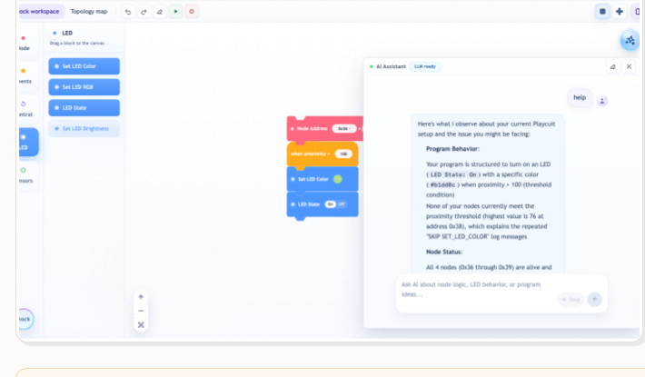

# Hi, I'm Yu Dian 👋

**LLM Agents · RAG Engineering · Applied ML · Verification Automation**

MSc AI for Science @ National University of Singapore

---

### `yudian.about()`

I build and evaluate LLM agent systems — from retrieval-augmented assistants to tool-calling
workflows — and ship them into real engineering products. My background spans applied ML
research, semiconductor verification automation, and hardware-aware prototyping, giving me range
across research, enterprise, and product contexts.

- 📍 Based in Singapore
- 🎯 Focus: Agentic AI & RAG
- 🛠️ Status: AI-enabled Formal Verification Intern @ Infineon Technologies
- 🌐 Full portfolio: [evelyn77yu.github.io](https://evelyn77yu.github.io)

### `yudian.skills()`

**Core AI engineering stack** — agents, retrieval, evaluation, and full-stack delivery, proven
across research, hardware, and enterprise workflows.

| | |
|---|---|
| **🤖 LLM & Agent Engineering** | Multi-step agent workflows, tool/function calling, structured outputs · Memory & context design, human-in-the-loop guardrails · Shipped in enterprise verification automation, engineering assistants, and personal AI tools |
| **📚 RAG & Context Engineering** | LangChain/LlamaIndex retrieval pipelines, chunking, embeddings, vector databases · Context-window design and hallucination reduction · Applied to debugging assistants, knowledge retrieval, and resume/JD matching tools |
| **🧪 Prompting & Model Evaluation** | System/task prompt design, Few-shot, CoT, Self-consistency CoT · Systematic accuracy and error-case / failure-mode analysis · Turns evaluation results into iteration loops for reliability improvement |
| **🧠 Applied ML & Deep Learning** | Transformers, attention, embeddings, representation learning · PyTorch, multimodal preprocessing, Python/Pandas/NumPy/SQL analysis · Applied to medical imaging, sentiment/network data, and reasoning-reliability research |
| **⚙️ Full-Stack AI Product Engineering** | Python, JavaScript/TypeScript, React, FastAPI/Node.js · LLM APIs (OpenAI/Azure), REST, SQL/NoSQL, Docker, Git, cloud deployment · Turns model capability into working, user-facing prototypes end to end |
| **🌉 Cross-Domain Delivery** | Stakeholder-facing problem decomposition and live workflow debugging · Documentation, traceability, and feedback-driven iteration · Proven across semiconductor verification, embedded/hardware, and product contexts |

### `yudian.projects()`

AI and model-evaluation work across medical imaging and LLM reliability, plus data/network systems
and personal tooling.

**AI & Model Projects**

- **Brain MRI Image Processing and Pretraining** · *Jan. 2026 – Present · NUS Medicine and Engineering*
  Python workflows for MRI preprocessing, standardization, quality checking, and experiment sample
  generation to support deep learning training, inference experiments, and reproducible experiment
  management. `Python` `PyTorch` `Deep Learning` `Medical Imaging`

- **LLM Reasoning Reliability and Prompt Strategy Evaluation** · *Mar. 2026 – May 2026 · Course Project*
  Evaluation workflow comparing Direct Prompting, Zero-shot CoT, Few-shot CoT, and Self-consistency
  CoT across reasoning tasks; turned error patterns into prompt iteration notes for agent-output
  quality checks. `LLM APIs` `Prompt Engineering` `CoT` `Model Evaluation`

**Data, Network & Personal Tools**

- **Multimodal Content Understanding Data Processing** · *Sep. 2025 – Oct. 2025 · ZhangLab, NUS SoC*
  Processed text, image, and bounding-box annotation datasets; built Python cleaning workflows to
  align text aspects with visual regions and validate multimodal consistency. `Python` `Data Cleaning` `Annotation QA`

- **Ethereum P2P Large-Scale Network Data Analysis** · *Oct. 2025 – Dec. 2025 · Course Project*
  Python-based P2P network analysis and simulation framework using real Ethereum network data:
  topology construction, metric calculation, visualization, and propagation simulation. `Python` `Graph Analysis` `Visualization`

- **AI-RAG-Resume** · *Ongoing · Side Project*
  Personal AI tool using LangChain/LlamaIndex-based RAG, vector retrieval, and matching scores with
  LLM APIs to assist JD parsing, project recommendation, and resume version management. `RAG` `Vector Search` `LLM APIs`

### `yudian.experience()`

- **2026.07 – Present** — **Infineon Technologies** · AI-enabled Formal Verification Intern
  Worked with Unix/Linux, GitLab, Jira, CI/CD, and scripted workflows in formal verification
  processes; supported agent-assisted workflow optimization for XML-to-vPlan comparison,
  distribution, change synchronization, and function checks, integrating agent patterns, skill
  constraints, MCP-style tool integration, and structured output/function calling.

- **2026.03 – Present** — **NUS Soft Technologies Lab** · Part-time Research Assistant
  *Playcuit AI Assistant — context-aware agent prototype for engineering workflows.* Designed a
  software-hardware engineering platform combining block-style programming, hardware topology, node
  status, and runtime feedback. Built an AI assistant layer using OpenAI/Azure OpenAI APIs,
  LangChain/LlamaIndex orchestration, and RAG knowledge base patterns to explain code/system
  behavior and guide debugging. Also handled a SteamVR 2.0 base-station receiver positioning task
  using AI-assisted embedded development.

  

- **2025.03 – 2025.07** — **Tsinghua University Brain-Computer Interface Lab** · Research Assistant
  Supported hardware architecture design for a portable EEG system with edge AI signal processing,
  including component selection, multi-board design, and low-power tradeoffs.

<b>Earlier experience</b> — PCB engineering & product design

 

- **2023.10 – 2024.10** — China Information and Communication Technologies Group Subsidiary · PCB Engineer
  Automotive-grade SoC core-board projects for UAV and V2X applications; built internal scripted
  checks and review checklists that improved schematic/PCB review handoff.
- **2022.02 – 2023.07** — TP-LINK · PCB Engineer
  Handled 100+ consumer electronics PCB projects including routers, cameras, switches, and power
  products, collaborating with mechanical, engineering, product, and manufacturing teams.
- **2021.03 – 2021.09** — Shenzhen Leyi Network Co., Ltd. · Game System Designer
  Designed gameplay systems, numerical balance, and virtual economy based on user behavior analysis
  and competitor research.

### `yudian.education()`

- **National University of Singapore** — AI for Science *(2025.08 – Present)*
  Text Processing & Interpretation with Machine Learning; Practical Machine Learning for Scientific
  Discovery; Foundations of Deep Learning.
- **Beihang University** — Electronic and Information Engineering *(2016.09 – 2020.06)*
  Programming in C; Electronic Circuit; Probability Theory and Mathematical Statistics.

### `yudian.more()`

- 🎥 **Portfolio deck:** [View AI product portfolio](https://docs.google.com/presentation/d/1BRf9QQl-jkg2S6Ami8ydu_5oWBn5sBfneaTeVpA86V4/edit?usp=sharing) — the Playcuit AI Assistant product story, from feature design to context-aware debugging UX.
- 🏅 Second-Class Outstanding Social Work Scholarship; NUS AI and Telecommunication Engineering Summer Programme
- 🗣️ Native Mandarin; English for technical & cross-functional collaboration

---

### `yudian.contact()`

Open to LLM/agent engineering, applied ML, and AI product roles.

📫 **e1553737@u.nus.edu**

Full site & design at <a href="https://evelyn77yu.github.io">evelyn77yu.github.io</a>

